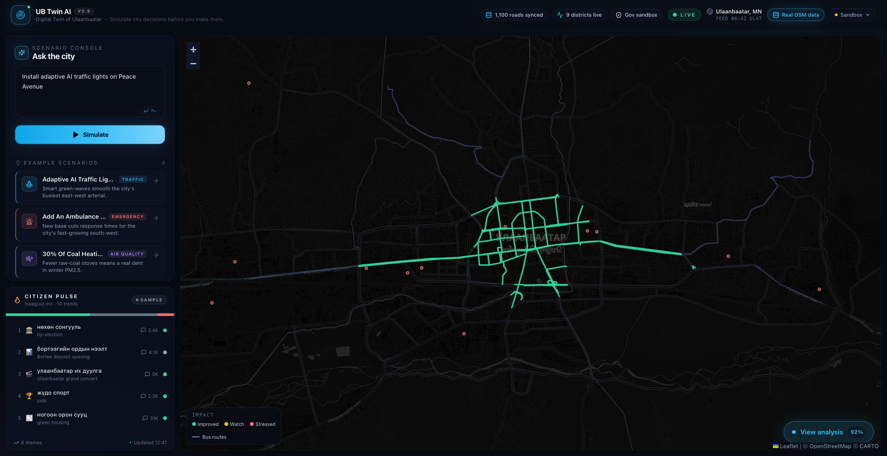

# UB Twin AI — AI Digital Twin of Ulaanbaatar

> **Don't build the future city. Simulate it first.**

An AI-powered digital twin of Ulaanbaatar that lets officials, planners, and
citizens **simulate city decisions before making them**. Instead of asking
"what should we do?", ask **"what happens if we do this?"** — and watch the city
respond across traffic, air quality, emergency response, energy, and transit.

Built for the **Smart City AI Hackathon 2026**.



---

## What it does

Pick a scenario (or type your own in natural language) and the engine predicts
city-wide impact, paints the affected areas on a live map, and explains the
trade-offs — plus a proactive **Future Risk Radar** of what the city should
brace for next.

Try:

| Scenario | The twin predicts |
| --- | --- |
| *Adaptive AI traffic lights on Peace Avenue* | −18% congestion, 38→26 min cross-town, −6% traffic CO₂ |
| *Add an ambulance station in Yarmag* | served-area response 9→4 min, ~26k residents gain faster access |
| *30% of coal heating switches to electric* | PM2.5 −22%, ₮328B healthcare savings — **but** grid headroom turns negative |
| *Close Peace Avenue for one week* | +25% travel time, arterials turn red, knock-on air effects |

Every number is computed deterministically from the scenario and the **real
geometry of Ulaanbaatar** — not hard-coded.

---

## Architecture (the four layers from the brief)

```
┌─ City Knowledge Layer ─────────────────────────────────────────────┐
│  Real OpenStreetMap data for UB: 9 districts, 1,100 arterial roads, │
│  bus routes, 278 hospitals/clinics, 15 fire/ambulance stations,     │
│  263 schools, 508 bus stops — fetched via Overpass. District AREA is │
│  computed from the real polygons; population is real (Wikidata/NSO)  │
│  where available, else a calibrated NSO estimate.                   │
│  → src/lib/data/*.json · src/lib/city.ts · scripts/fetch-*.mjs      │
├─ Simulation Layer ─────────────────────────────────────────────────┤
│  5 deterministic domain models + a risk predictor, each a pure      │
│  function (scenario, city) → result, composed by an orchestrator.   │
│  → src/lib/sim/{traffic,pollution,emergency,energy,transit,risk}.ts │
│  → src/lib/sim/index.ts                                             │
├─ Reasoning Layer (DeepSeek LLM, with deterministic fallback) ──────┤
│  NL → structured scenario (LLM interpret, rules for presets);       │
│  LLM analyst writes the briefing grounded ONLY in computed numbers. │
│  No key / failure → rule-based parse + template. Demo never breaks. │
│  → src/lib/scenarios.ts · src/lib/ai/{deepseek,interpret,narrate}.ts│
├─ Civic Pulse Layer (tsaaguur.mn — real FB + news sentiment) ───────┤
│  Live public-opinion trends, and a scenario↔opinion matcher so the  │
│  twin predicts physical impact AND public reaction. The analyst     │
│  weaves real sentiment into its briefing.                           │
│  → src/lib/social/* · /api/pulse                                    │
├─ Visualization Layer ──────────────────────────────────────────────┤
│  Leaflet map (free CARTO basemap, no token) + dashboard panels:     │
│  road heat, district choropleths, coverage circles, risk feed.      │
│  → src/components/*  ·  src/app/page.tsx                            │
└────────────────────────────────────────────────────────────────────┘
```

The browser stays light: heavy geometry is served from `/api/city`, and
scenarios run server-side at `/api/simulate`.

> **AI + social layers are optional.** With `DEEPSEEK_API_KEY` set, scenario
> understanding and the analyst run on DeepSeek; with `TSAAGUUR_API_URL` set,
> the civic pulse is live. Without either, the app falls back to the
> deterministic rule-based engine and a bundled trend sample — it always runs.

---

## Run it

```bash
npm install
npm run dev          # http://localhost:3000
```

Production build:

```bash
npm run build && npm start
```

Refresh the real OSM data (optional — already bundled):

```bash
npm run fetch-data   # re-queries Overpass for Ulaanbaatar
```

Smoke-test the engine against the running server:

```bash
node scripts/smoke.mjs
```

---

## Tech

- **Next.js 14** (App Router) · **React 18** · **TypeScript** · **Tailwind**
- **Leaflet** + react-leaflet · free **CARTO** dark basemap (no token)
- **Recharts** for the baseline-vs-predicted comparison
- **OpenStreetMap / Overpass** for real city geometry · **lucide-react** icons

## Data & accuracy

Geometry, district **area**, and bus routes are real OSM data; **population** is
real (Wikidata/NSO) where a recent value exists, else a calibrated NSO estimate
(per-district provenance is tracked in `populationSource`). The simulation
coefficients (baseline congestion, PM2.5 model, grid capacity, etc.) are
calibrated public estimates — this is a decision-support *simulator*, not a
calibrated forecast. Where real data contradicts a convenient assumption (e.g.
Yarmag already has nearby stations, or Wikidata's 2009 population figures), the
twin uses the better/honest value. Civic sentiment is real (tsaaguur.mn).
# ub-simulation
